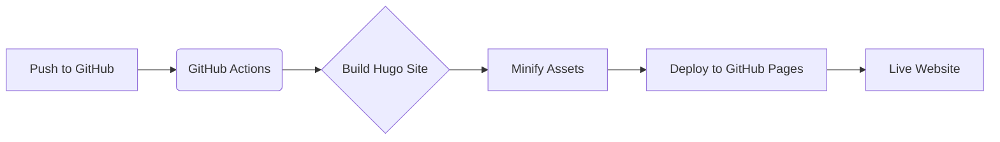

Welcome to my first blog post! Since this is a personal site, it felt only right to start by talking about how this corner of the internet came to be.

When I decided to build my personal site, I wanted something **fast, reliable, and easy to maintain**. Hugo stood out for its incredible speed and its powerful static site generation capabilities. After exploring several options, I landed on **PaperMod**. It’s clean, responsive, and its "profile mode" perfectly fits my goal of a minimalist yet functional landing page.

## The Tech Stack

| Component | Technology |
| :--- | :--- |
| **SSG** | [Hugo](https://gohugo.io/) |
| **Theme** | [PaperMod](https://github.com/adityatelange/hugo-PaperMod) |
| **Forms** | [Formspark](https://formspark.io/) |
| **Hosting** | GitHub Pages |
| **CI/CD** | GitHub Actions |

## Key Features

### 1. Minimalist Design
I’m using PaperMod in its **Profile Mode**, which focuses on a minimalist introduction and social links right on the landing page. It’s a perfect way to show who I am and what I do without unnecessary clutter. To enhance the user experience, I've also enabled features like:
- **Fast Search**: Powered by Fuse.js for instant results.
- **Dark Mode**: Automatically respects your system preferences.
- **Social Icons**: Direct links to my GitHub, LinkedIn, and Hugging Face.

### 2. Fully Automated CI/CD
Managing a site shouldn't involve manual uploads. I've set up a **GitHub Actions** workflow that triggers automatically whenever I push to the `main` branch. 

The pipeline handles:
1. **Hugo Extended Installation**: Ensuring support for SCSS/SASS.
2. **Minification**: Compressing HTML, CSS, and JS to ensure lightning-fast load times.
3. **Deployment**: Pushing the final build artifacts to GitHub Pages within seconds.

### 3. Serverless Contact Form
Instead of maintaining a full backend for a simple contact form, I integrated **Formspark**. It provides a simple endpoint for form submissions, making it easy to receive messages while keeping the site entirely static and secure. You can find it on my [Contact](/contact) page.

### 4. Privacy & Compliance
Operating from Germany means compliance is non-negotiable. I’ve ensured the site includes a proper [Imprint](/imprint) and [Data Privacy statement](/privacy) to meet GDPR requirements.

## What's Next?

This site will be a place for me to share my thoughts on **AI engineering**, **Machine Learning**, and whatever technical projects I'm currently working on. 

Expect more deep dives into:
- Building Agentic Workflows.
- Local LLM deployment.
- Technical challenges in AI engineering.

Stay tuned for more updates as I continue to build and share!
